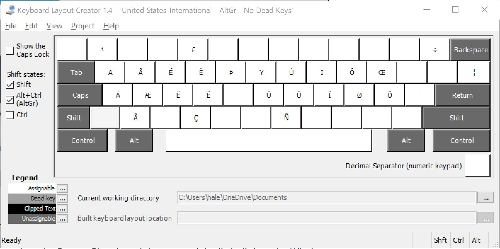

# US International Layouts (no dead keys) for Windows

By default, Windows includes a layout called United States-International, which allows typing many non-ASCII characters. It is very useful for several Latin-script based languages, covering most of the Latin 1 (ISO 8859 1) code page.

The layout designates several keys as "dead keys", particularly the apostrophe (') and double quotes ("). So to enter double quotes, you have to type " followed by space. Some other characters are available by using AltGr as a dead key.

For some use cases, this can be annoying, in particular if you don't need the non-ASCII characters that are entered with the help of those dead keys. With the Microsoft US-International layout you can type several languages by only using the AltGr dead key. For example, you can type ä å ö ü ß ø æ and accented vowels by using various AltGr combinations, meaning AltGr is roughly sufficient for German, Scandinavian (Danish, Faroese, Finnish, Icelandic, Norwegian, Swedish) and Spanish, among others.

This repository contains two layouts that are United States-International based, but remove the apostrophe ('), double quotes ("), circumflex (^), backtick (``) and tilde (~) as dead keys, while leaving the AltGr dead key combinations intact. The first of them keeps the original layout specified by Microsoft and covers Spanish, German, and Scandinavian, perhaps among others, while the second is dedicated to French, following a Linux-Ubuntu specification.

The names of the keyboards require a little explanation: 

1. On February 15, 1858, the Texas Legislature passed a law in Austin appropriating funds to translate and print state laws into Spanish, German, and Norwegian, the mother tongue of a significant part of the population of the State at the time; since these are the main languages covered by the standard US Intl Keyboard with AltGr NoDeadKeys, the keyboard has been renamed as "Texas 1858", given the code name "kbdusxtx", and assigned LCID 540A, or "Spanish US".
2. The islands of St Pierre and Miquelon are the remains of the once large territory of Nouvelle France; nowadays they are a French Overseas Collectivity (since 1985; Territory since 1946, after a long take and give with the United Kingdom). So, technically, there is some French territory in Northern America: thus the keyboard code name is now "kbdusxfr", it has been assigned the LCID 0C0C or "French Canada", and the keyboard name is "Acadien", to commemorate the first succesful French settlement (Port Royal, Acadia, 1605; today's Annapolis Royal, Nova Scotia) in the New World.

The standard US keyboard layout is the following:

Following the Linux version "US-International with French letters" in Ubuntu 20.04 LTS

# Install

- Install [Microsoft Keyboard Layout Creator (MKLC) 1.4](https://www.microsoft.com/en-us/download/details.aspx?id=22339)
- Problem [.NET framework 2.5 must be install](https://answers.microsoft.com/en-us/windows/forum/windows_10-hardware/microsoft-keyboard-layout-creator-14-instalation/092881f1-470b-4a66-889f-59e868c6b25a)
  - The .NET Framework is an integral part of many applications running on Windows
  and provides common functionality for those applications to run.
  - Normally, before running/installing such applications, we need to enable .NET
  Framework from the Control Panel on the computer.
  - Press `WIN+R`
  - Run `appwiz.cpl`
  - In the "Programs and Features" window, click on the link "Turn Windows features on or off".
  - Check if the ".NET Framework 3.5 (includes .NET 2.0 and 3.0)" option is available in it.
  - If yes, then enable it.
  - Follow the on-screen instructions to complete the installation and restart the computer, if prompted.
  - This will install the .NET Framework 3.5 feature on the computer.
    Now try installing Microsoft Keyboard Layout Creator 1.4 and check if it installs.

# How to build / install

The layout file can be opened with Microsoft's Keyboard Layout Creator (MKLC) tool, which Microsoft distributes for free. After opening the file in MKLC, choosing Project -> Build DLL and Setup Package will create an installer that can be used to add this layout to Windows.

**Remember** to log off and on again, in order for the changes to take effect.

# Autohotkey DualControl

Download [Autohotkey](https://www.autohotkey.com/)

Find `Convert ahk to exe`, and add the downloaded `ahk` as source.

The script returns an exe that uses to activate dual-control mode.
